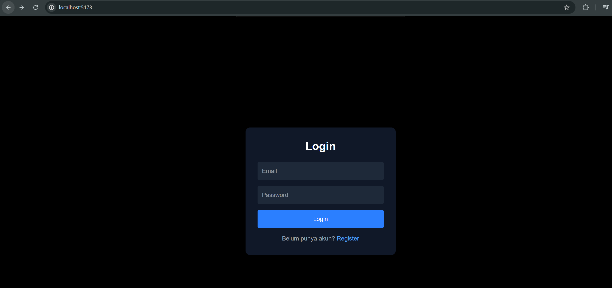
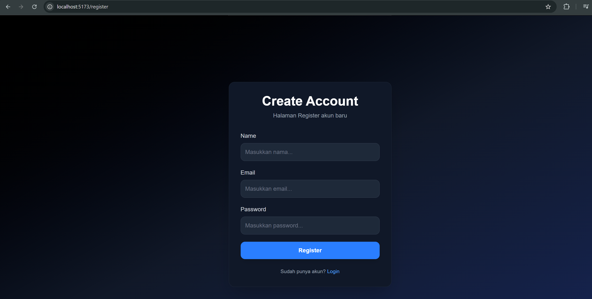
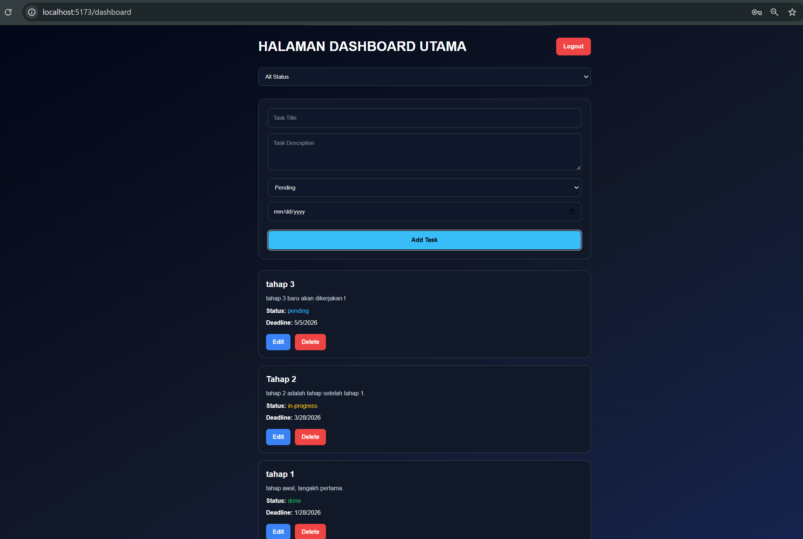

# Task Management System

A modern fullstack Task Management System built using the MERN Stack (MongoDB, Express.js, React.js, and Node.js). This application allows users to securely manage their personal tasks through authentication, task organization, and status tracking features.

The system provides complete CRUD functionality, JWT-based authentication, task filtering, deadline management, and responsive user interfaces designed for productivity and usability.

This project was developed as part of a Fullstack Web Developer technical assessment to demonstrate backend API development, frontend integration, database management, authentication, and responsive UI implementation.

------------------------------------------------------------------------------------------------------------------------------------

Sistem Manajemen Tugas berbasis fullstack modern yang dibangun menggunakan MERN Stack (MongoDB, Express.js, React.js, dan Node.js). Aplikasi ini memungkinkan pengguna untuk mengelola tugas pribadi secara aman melalui fitur autentikasi, pengelolaan tugas, dan pelacakan status pekerjaan.

Sistem ini menyediakan fitur CRUD lengkap, autentikasi berbasis JWT, filtering tugas berdasarkan status, pengelolaan deadline, serta antarmuka responsif yang dirancang agar mudah digunakan dan mendukung produktivitas pengguna.

Project ini dikembangkan sebagai bagian dari technical assessment Fullstack Web Developer untuk menunjukkan kemampuan dalam pengembangan REST API backend, integrasi frontend, pengelolaan database, autentikasi pengguna, dan implementasi antarmuka modern yang responsif.

## Features

### Authentication
- Register User
- Login User
- JWT Authentication
- Password Hashing using bcrypt
- Logout
- Protected Routes

### Task Management
- Create Task
- Read Task List
- Update Task
- Delete Task
- Filter Task by Status

### Task Attributes
- Title
- Description
- Status
- Deadline
- User Relation


# 🛠 Tech Stack

## Frontend
- React.js
- Axios
- CSS

## Backend
- Node.js
- Express.js
- MongoDB Atlas
- Mongoose
- JWT
- bcryptjs


# Project Structure

```bash
task-manager-app/
│
├── backend/
│   ├── src/
│   ├── .env.example
│   ├── package.json
│
├── frontend/
│   ├── src/
│   ├── package.json
│
├── README.md
```

---

# Backend Setup

## Open backend folder

```bash
cd backend
```

---

## Install dependencies

```bash
npm install
```

---

## Create .env file

Create `.env` file inside backend folder.

Example:

```env
PORT=5000

MONGO_URI=your_mongodb_connection

JWT_SECRET=your_secret_key
```

---

## Run backend

```bash
npm run dev
```

Backend running at:

```bash
http://localhost:5000
```

---

# ⚙️ Frontend Setup

## 1️⃣ Open frontend folder

```bash
cd frontend
```

---

## 2️⃣ Install dependencies

```bash
npm install
```

---

## 3️⃣ Run frontend

```bash
npm run dev
```

Frontend running at:

```bash
http://localhost:5173
```

---

# API Endpoints

## Authentication

### Register

```http
POST /api/auth/register
```

### Login

```http
POST /api/auth/login
```


## Tasks

### Get Tasks

```http
GET /api/tasks
```

### Filter Tasks

```http
GET /api/tasks?status=pending
```

### Create Task

```http
POST /api/tasks
```

### Update Task

```http
PUT /api/tasks/:id
```

### Delete Task

```http
DELETE /api/tasks/:id
```

---

# Screenshots

## Login Page



---

## Register Page



---

## Dashboard



---

# Author

Developed by Hafizh Syafiqh
